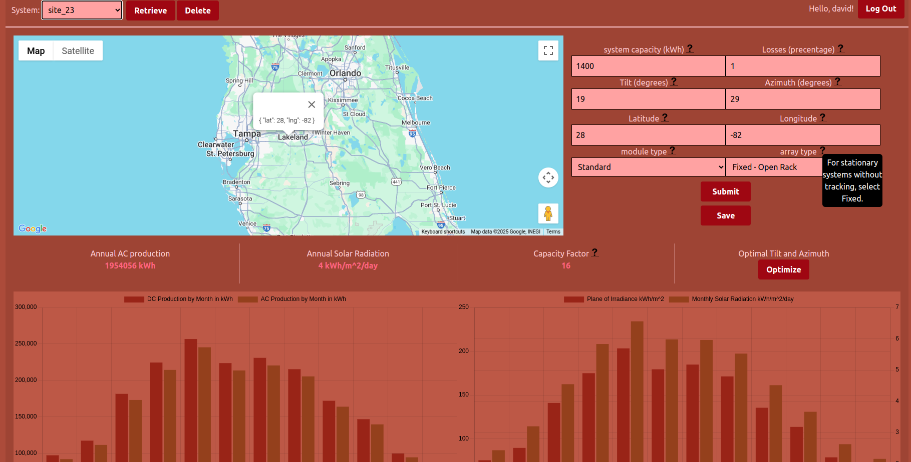

## Photovoltaic Energy Output Visual Dashboard
This is a work in progress that will eventually iclude a full UI connected to 3rd party API's for retrieving and displaying Photovoltaic Energy output for systems based on system parameters and location.
Will include a database in which users can save results that show favorable energy outputs and calculate optimal tilt and azimuth for maximum system output at any given location.

